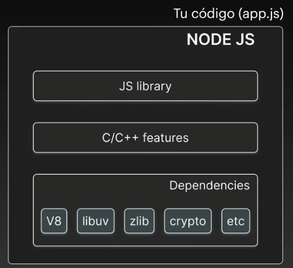
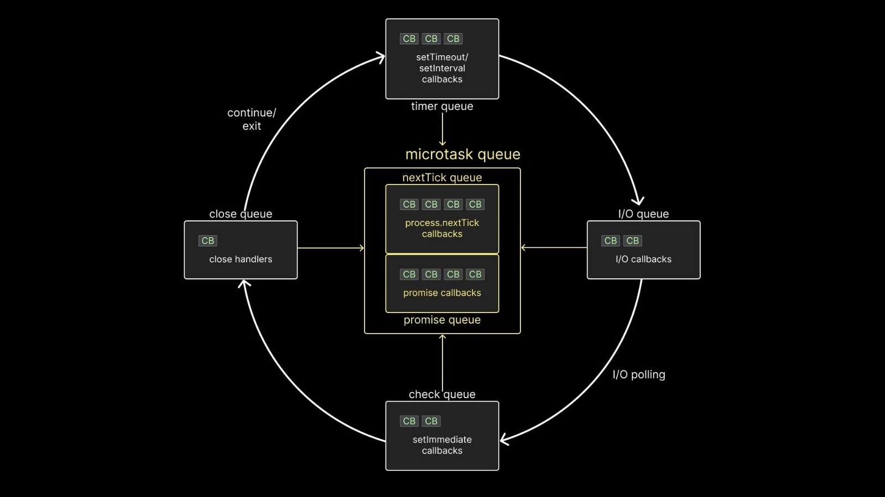

# `Sección 2`

### ` Fundamentos de Node - Primeros pasos`


Temas puntuales de la sección
En esta sección quiero que nos enfoquemos en varias introducciones a Node, puntualmente veremos:

- Preguntas comunes sobre Node
- Hola Mundo en Node
- Laboratorio con FileSystem
- Code Execution
- Event Loop

Tengan presente que el curso es 99% practico, pero la mayor parte de las presentaciones están en esta sección, porque me interesa que conozcamos el por qué de muchas cosas que sucederán cuando estén trabajando con Node en la vida real.

### `Preguntas comunes sobre NodeJS`
Node habilita que se pueda usar js en un ambiente que no sea un navegador web.
Construido sobre el motor v8 de google chrome.
Esta diseñado para realizar tareas de entrada y salida
Manejo de archivos cliente/servidor

_Caracteristicas_
- Asincronia
- Modulos nativos y de terceros
- Gestion de paquetes con NPM
- Construcción de servidores
- Escalabilidad
- Multiple plataforma
- Non-Blocking I/O: Casi ninguna funcion en Node bloquea la lectura, por lo que podemos tener cientos de peticiones sin bloquear el servidor esto gracias a libuv
- NPM (Node Package Manager)
- NPX (Node Package Execute)

https://nodejs.org/en/docs/guides/blocking-vs-non-blocking

#### I/O
Se refiere principalmente a la interacción con el disco duro del sistema.
- Blocking: Es cuando la ejecución del código debe de esperar a que se complete el proceso pero este a su vez, impide que se sigan ejecutando otras instruccipines en paralelo.


### `Hello World - En Node`

### `Archivos de JavaScript`
No es necesario definir la extension del archivo js
```bash
node .\app

Hola mundo!
```

### `Lectura de archivos con JavaScript`

### `Tarea - Contador de palabras`
```js
const fs = require('fs');
const content = fs.readFileSync('./README.md', 'UTF-8');
const words = content.split(" ");
const reactWord = words.filter((word) => {    
    if( word.toLocaleLowerCase() === 'react' ) {
        return 'react';
    }
});

const reactWordgi = content.match(/react/gi ?? []).length;


console.log('reactWord:', reactWord.length);
console.log('Palabras:', reactWord.length);
console.log('reactWordgi:', reactWordgi);
```


### `Orden de ejecución - Introducción`


### `Node - Code Execution`
JS es Blocking y Single-Threaded, casi todo el codigo de js es blocking.

3 Componentes principales de NODE
- Dependencias externas
- Caracteristicas de C++
- Librerías de JS que se conectan con C++ desde nuestro código




### `Node - Event Loop`


1. Callback en el microtask se ejecutan primero.
2. Todos los callbacks dentro del timer queue se ejecutan.
3. Callbacks en el microtask queue(si hay) se ejecutan después de los callback timers, primero tareas en el nextTick queue y luego tareas en el promise queue.
4. Callbacks de I/O se ejecutan.
5. Callbacks en el microtask queue se ejecutan y luego promise queue.
6. Todos los callbacks en el check queue se ejecutan
7. Callbacks en el microtask se ejecutan después de cada callback en el check queue. (nextTick y luego promise) 
8. Todos los callbacks en el close queue son ejecutados
9. Por ultima vez en el mismo ciclo, los microstask queues son ejecutados de la misma forma, nextTick y luego promise queue.

[https://www.builder.io/blog/visual-guide-to-nodejs-event-loop](https://www.builder.io/blog/visual-guide-to-nodejs-event-loop)

# `Sección 3: Desarrollando en Node`

`Temas puntuales de la sección`

En esta sección veremos generalidades de Node y a la vez, aprovechamos para explicar ciertos conceptos de JavaScript que son necesarios para casi cualquier aplicación de Node.

Puntualmente veremos:

- Package.json
- Node Modules
- Scripts
- Importaciones y Exportaciones
- Módulos
- Reforzamiento de JS
- Callbacks
- Arrow Functions
- Factory Functions
- Promises
- Async Await
- Peticiones Http básicas
- Dependencias de Producción y Desarrollo
- Patrón adaptador para nuestras dependencias

Esta sección es altamente recomendada para todos los que están empezando con NodeJS, y a la vez, sirve para refrescar un poco la memoria sobre JavaScript.


### `Inicio de proyecto - Fundamentos`
Crear archivo de package.json

```bash
npm init
```
El archivos de package.json es el origen de la aplicación que determinara versiones, scripts y datos relevantes de la aplicación.


### `Package.json Scripts`
El comando _start_ es un comando especial por el que no tenemos que definir el _run_ cuando hacemos `npm start`

### `Importaciones y exportaciones`
Metodo de importación tradicional en js
_01-template.js_
```js
const emailTemplate = `
    <div>
        <h1>Hi {{name}}</h1>
        <p>Gracias por su orden.</p>
    </div>
`;

module.exports = {
    emailTemplate
}
```

_app.js_
```js
const { emailTemplate } = require('./js-foundation/01-template');
```

### `Nodemon - Paquetes de terceros`
```bash
npm install nodemon --save-dev
```

Agregamos el comando _"dev": "nodemon src/app.js"_ a los scripts de package.json.


### `Variables de entorno por defecto`
La variables _process_ contiene datos del proceso, de la ejecución y valores asignados por el desarrollador.

```js
//console.log('process');
const { COMPUTERNAME, VSCODE_GIT_IPC_HANDLE } = process.env;

//console.table({COMPUTERNAME, VSCODE_GIT_IPC_HANDLE});

const characters = ["flash", "batman", "superman"];
const [, batman, ] = characters;
//console.log(batman);
```